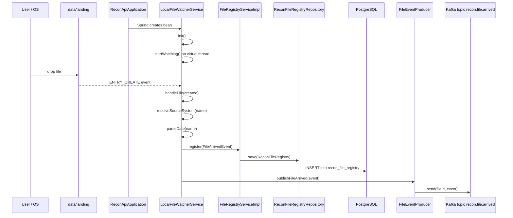

# Recon file flow from `data/landing` to DB

This document explains what happens in this codebase when you place a file into `data/landing`, which classes and methods are called, and how data reaches the database.

> Important: this document separates **what is implemented right now** from **what looks prepared but is not yet wired end-to-end**.

---

## 1) Big picture

### What is implemented today
When a file is dropped into `data/landing`:

1. The Spring Boot app starts from `recon-api`.
2. A local file watcher starts automatically.
3. The watcher detects the new file.
4. The watcher builds a `FileArrivedEvent`.
5. The file is inserted into the DB table `recon_file_registry` with status `RECEIVED`.
6. The event is published to Kafka topic `recon.file.arrived`.

### What is **not** wired automatically today
The codebase already contains classes for:

- parsing the file
- loading parsed rows into `recon_staging`
- validating rows
- matching rows into reconciliation results
- writing to `recon_results`

But there is currently **no Kafka consumer / orchestration service** that connects the file-arrived event to those classes.

So the real current flow is:

`data/landing` -> watcher -> `recon_file_registry` -> Kafka topic

And it currently stops there unless some additional orchestration is added.

---

## 2) Startup flow: which app starts everything

### Entry point
File: `recon-api/src/main/java/com/recon/api/ReconApiApplication.java`

Main method:
- `ReconApiApplication.main(String[] args)`
- calls `SpringApplication.run(...)`

Annotations:
- `@SpringBootApplication(scanBasePackages = "com.recon")`
- `@EnableJpaRepositories(basePackages = "com.recon")`
- `@Import(KafkaConfig.class)`
- `@EnableAsync`

What this means:
- Spring scans all modules under package `com.recon`
- JPA repositories are enabled
- Kafka producer/consumer beans are created from `KafkaConfig`
- async support is enabled

### Runtime configuration
File: `recon-api/src/main/resources/application.yml`

Relevant properties:
- `recon.landing-zone.mode: local`
- `recon.landing-zone.path: ${LANDING_ZONE_PATH:data/landing}`
- `spring.datasource.*` -> PostgreSQL connection
- `spring.flyway.enabled: true`
- `recon.kafka.topics.file-arrived: recon.file.arrived`

So by default the application watches:
- `data/landing`

### DB schema creation on startup
Because Flyway is enabled, these SQL migrations run at startup from:
- `recon-storage/src/main/resources/db/migration/`

Important tables created:
- `V1__create_staging_table.sql` -> `recon_staging`
- `V2__create_recon_results_table.sql` -> `recon_results`
- `V3__create_audit_errors_table.sql` -> `recon_audit_errors`
- `V4__create_file_registry_table.sql` -> `recon_file_registry`
- `V5__create_tolerance_table.sql` / `V6__indian_payment_tolerance_config.sql` -> `rcon_tolerance_config`
- `V7__widen_rcon_code_columns.sql` -> widens `rcon_code` columns

---

## 3) File watching flow when you drop a file into `data/landing`

### 3.1 Watcher bean selection
File: `recon-ingestion/src/main/java/com/recon/ingestion/watcher/LocalFileWatcherService.java`

Class:
- `LocalFileWatcherService implements FileWatcherService`

Annotation:
- `@ConditionalOnProperty(name = "recon.landing-zone.mode", havingValue = "local", matchIfMissing = true)`

Meaning:
- if `recon.landing-zone.mode=local`, this watcher is active
- this is the default mode in `application.yml`

Alternative class:
- `recon-ingestion/src/main/java/com/recon/ingestion/watcher/S3PollingWatcherService.java`
- active only when `recon.landing-zone.mode=s3`

Scheduling for S3 is enabled by:
- `recon-ingestion/src/main/java/com/recon/ingestion/config/IngestionConfig.java`
- annotation: `@EnableScheduling`

---

### 3.2 Watcher startup method call chain

When Spring creates `LocalFileWatcherService`, this method runs automatically:

- `LocalFileWatcherService.init()`

Why?
- it has `@PostConstruct`

Inside `init()`:
- `Thread.ofVirtual().name("recon-file-watcher").start(this::startWatching);`

So the actual watcher loop begins in:
- `LocalFileWatcherService.startWatching()`

---

### 3.3 What `startWatching()` does

Method:
- `LocalFileWatcherService.startWatching()`

Step by step:

1. Reads the configured directory:
   - `Path dir = Path.of(landingPath)`

2. If the directory does not exist:
   - logs warning and returns

3. Creates Java NIO watch service:
   - `FileSystems.getDefault().newWatchService()`

4. Registers directory for file-create events:
   - `dir.register(watchService, StandardWatchEventKinds.ENTRY_CREATE)`

5. Enters infinite loop:
   - `watchService.take()` waits for events
   - for each event:
     - resolves the created file path
     - calls `handleFile(created)`

So the next important method is:
- `LocalFileWatcherService.handleFile(Path created)`

---

## 4) Exact flow inside `handleFile(...)`

Method:
- `LocalFileWatcherService.handleFile(Path created)`

### 4.1 File extension filter
Only these files are processed:
- `.dat`
- `.csv`
- `.txt`

Logic:
- filename converted to lower case
- if extension is not one of those, method returns immediately

### 4.2 Source system detection
Method called:
- `LocalFileWatcherService.resolveSourceSystem(String name)`

Mapping implemented:
- `UPI_...` -> `SourceSystem.UPI`
- `IMPS_...` -> `SourceSystem.IMPS`
- `NEFT_...` -> `SourceSystem.NEFT`
- `RTGS_...` -> `SourceSystem.RTGS`
- anything else -> warning logged, defaults to `UPI`

### 4.3 Report date extraction
Method called:
- `LocalFileWatcherService.parseDate(String fileName)`

Logic:
- removes all non-digits from filename
- takes first 8 digits
- parses them as `yyyyMMdd`
- if not available, falls back to `LocalDate.now()`

Example:
- `UPI_RECON_20260429_093000_001.dat`
- extracted date -> `2026-04-29`

### 4.4 Event object creation
Class:
- `recon-common/src/main/java/com/recon/common/dto/FileArrivedEvent.java`

Constructed values:
- `fileId` -> random UUID string
- `fileName` -> actual filename
- `sourceSystem` -> from prefix resolution
- `filePath` -> absolute path of created file
- `reportDate` -> parsed from filename
- `arrivedAt` -> current timestamp

### 4.5 First DB write: file registry insert
Method called next:
- `fileRegistryService.register(arrivedEvent)`

Concrete implementation:
- `recon-storage/src/main/java/com/recon/storage/service/FileRegistryServiceImpl.java`
- method: `FileRegistryServiceImpl.register(FileArrivedEvent event)`

What happens inside:

1. Checks if `fileId` already exists:
   - `ReconFileRegistryRepository.findByFileId(event.fileId())`

2. If found:
   - throws `DuplicateFileException`

3. Otherwise builds entity:
   - `ReconFileRegistry.builder()...build()`

4. Saves entity using:
   - `ReconFileRegistryRepository.save(...)`

### 4.6 Which table gets data here
Table:
- `recon_file_registry`

Created by:
- `recon-storage/src/main/resources/db/migration/V4__create_file_registry_table.sql`

Important columns populated at this stage:
- `file_id`
- `file_name`
- `source_system`
- `file_path`
- `report_date`
- `file_status = RECEIVED`
- `received_at`

Note:
- `total_records`, `loaded_records`, `failed_records`, `control_amount`, `completed_at` are **not** populated by the current watcher flow

### 4.7 Kafka publish
After registry insert, the watcher calls:
- `fileEventProducer.publishFileArrived(arrivedEvent)`

Concrete class:
- `recon-ingestion/src/main/java/com/recon/ingestion/kafka/FileEventProducer.java`

Method:
- `FileEventProducer.publishFileArrived(FileArrivedEvent event)`

What it does:
- uses `KafkaTemplate<String, FileArrivedEvent>`
- sends message to topic from property `recon.kafka.topics.file-arrived`
- key = `event.fileId()`
- value = full `FileArrivedEvent`

Configured topic value:
- `recon.file.arrived`

Kafka beans are configured in:
- `recon-ingestion/src/main/java/com/recon/ingestion/config/KafkaConfig.java`

---

## 5) Sequence diagram for the implemented flow

---

## 6) Where the current automatic flow stops

I checked the Java source for a Kafka consumer such as:
- `@KafkaListener`

There is currently **no implemented Kafka listener / consumer orchestration** that automatically continues the pipeline after `recon.file.arrived` is published.

That means:
- `FlatFileParserService` is present, but not auto-invoked from the watcher/Kafka path
- `PostgresBulkLoader` is present, but not auto-invoked from the watcher/Kafka path
- `StagingItemReader`, `ValidationItemProcessor`, `ReconMatchingProcessor`, and `ReconResultWriter` are present, but not wired into a running batch/service pipeline

Also:
- `ReconBatchConfig` currently contains only a placeholder comment
- `FileRegistryController.reprocess(...)` only changes status to `PARSING`; it does not start parsing/reloading by itself

So if your question is:

> “When I put a file in `data/landing`, how does it go all the way to DB?”

The accurate answer is:
- **today it only goes automatically into `recon_file_registry` and Kafka**
- **it does not yet automatically reach `recon_staging` or `recon_results`**

---

## 7) Prepared classes for the rest of the pipeline

Even though they are not wired end-to-end yet, here is how the rest of the flow is designed in code.

### 7.1 Parsing stage
File: `recon-ingestion/src/main/java/com/recon/ingestion/parser/FlatFileParserService.java`

Main method:
- `FlatFileParserService.parse(Path filePath, SourceSystem sourceSystem)`

Routing by extension:
- `.dat` -> `parsePipeDelimited(...)`
- `.csv` -> `parseCsv(...)`
- everything else -> `parseFixedWidth(...)`

#### `.dat` flow
Method:
- `parsePipeDelimited(...)`

Expected structure:
- first line = header
- last line = trailer
- middle lines = `DTL` records

Sub-methods used:
- `parseDtlLines(...)`
- `validateControlTotals(header, trailer, computed)`

Output:
- `ParseResult`
  - `parsedRecords`
  - `failedRecords`
  - `totalRecords`
  - `successfulRecords`
  - `computedControlTotal`

#### `.csv` flow
Method:
- `parseCsv(...)`

Uses:
- Apache Commons CSV

Expected CSV headers include:
- `fileId`
- `recordId`
- `reportDate`
- `entityId`
- `rconCode`
- `balance`
- `drCrInd`
- `currency`
- optional `sourceRef`
- optional `comments`

#### `.txt` / fixed-width flow
Method:
- `parseFixedWidth(...)`

Notes:
- `.txt` uses charset `Cp037`
- otherwise UTF-8
- parses fixed column slices into `ReconStagingDto`

---

### 7.2 Staging load into DB
File: `recon-storage/src/main/java/com/recon/storage/bulk/PostgresBulkLoader.java`

Main method:
- `PostgresBulkLoader.bulkInsertStaging(List<ReconStagingDto> records)`

What it does:
1. obtains JDBC connection from `DataSource`
2. unwraps PostgreSQL `PGConnection`
3. uses `CopyManager.copyIn(...)`
4. performs PostgreSQL bulk `COPY` into table `recon_staging`

Target columns:
- `file_id`
- `source_system`
- `record_id`
- `report_date`
- `entity_id`
- `rcon_code`
- `balance`
- `dr_cr_ind`
- `currency`
- `source_ref`
- `comments`

Table created by:
- `V1__create_staging_table.sql`

### Important note
`recon_staging` table has more columns than `ReconStaging` entity currently maps, for example:
- `entity_name`
- `account_code`
- `account_desc`
- `as_of_time`
- `source_ref`
- `comments`

The current bulk loader only loads the subset listed above.

---

### 7.3 Reading unprocessed staging rows
File: `recon-processing/src/main/java/com/recon/processing/step/StagingItemReader.java`

Method:
- `StagingItemReader.read()`

Flow:
1. on first call, fetches:
   - `ReconStagingRepository.findByProcessedFalse()`
2. stores iterator
3. returns one row at a time
4. when done, resets iterator to `null`

So this class is prepared to consume rows from:
- `recon_staging`
- where `processed = false`

---

### 7.4 Validation stage
File: `recon-processing/src/main/java/com/recon/processing/processor/ValidationItemProcessor.java`

Method:
- `ValidationItemProcessor.process(ReconStaging item)`

Checks performed:
- `rconCode` matches allowed pattern
- balance is not negative
- currency is valid ISO currency
- DR/CR indicator must be `DR` or `CR`
- duplicate detection using Guava `BloomFilter`
- bean validation on `ValidatedRecord`

Returns:
- `ValidatedRecord`

If validation fails:
- throws `ValidationException`

#### Accepted RCON patterns
- legacy: `RCON####`
- Indian payment format such as:
  - `RECON_UPI_CR`
  - `RECON_NEFT_DR`
  - `RECON_RTGS_REJ`

---

### 7.5 Matching / reconciliation stage
File: `recon-processing/src/main/java/com/recon/processing/processor/ReconMatchingProcessor.java`

Main methods:
- `process(ValidatedRecord item)`
- `processGroups(List<ValidatedRecord> records)`

Tolerance lookup:
- `RconToleranceConfigRepository.findByRconCode(...)`
- reads from table `rcon_tolerance_config`

Configured by migrations:
- `V5__create_tolerance_table.sql`
- `V6__indian_payment_tolerance_config.sql`

Matching logic:
- groups by `reportDate + entityId + rconCode`
- first source treated as baseline
- second distinct source treated as counterpart
- if only one side exists -> result becomes `PARTIAL`
- if difference within tolerance -> `MATCHED`
- else -> `BREAK`

Severity logic:
- `< 1,000` -> `LOW`
- `< 10,000` -> `MEDIUM`
- `< 100,000` -> `HIGH`
- otherwise -> `CRITICAL`

Output entity:
- `ReconResult`

---

### 7.6 Writing reconciliation results to DB
File: `recon-processing/src/main/java/com/recon/processing/writer/ReconResultWriter.java`

Method:
- `ReconResultWriter.write(List<? extends ReconResult> records)`

What it does:
- `reconResultRepository.saveAll(records)`

Target table:
- `recon_results`

Created by:
- `V2__create_recon_results_table.sql`

Important columns include:
- `recon_id`
- `report_date`
- `entity_id`
- `rcon_code`
- `source_system_a`
- `balance_a`
- `source_system_b`
- `balance_b`
- generated `difference`
- `tolerance`
- `match_status`
- `severity`
- `break_reason`
- `resolved`
- `created_at`
- `updated_at`

---

## 8) End-to-end logical flow the code is aiming for

This appears to be the intended full flow based on available classes:

1. File dropped into `data/landing`
2. `LocalFileWatcherService.startWatching()` gets create event
3. `handleFile(...)` builds `FileArrivedEvent`
4. `FileRegistryServiceImpl.register(...)` inserts into `recon_file_registry`
5. `FileEventProducer.publishFileArrived(...)` sends Kafka message
6. A missing consumer/orchestrator would receive that event
7. `FlatFileParserService.parse(...)` would parse the file into `ParseResult`
8. `PostgresBulkLoader.bulkInsertStaging(...)` would load parsed rows into `recon_staging`
9. `StagingItemReader.read()` would fetch unprocessed rows
10. `ValidationItemProcessor.process(...)` would validate rows
11. `ReconMatchingProcessor.process(...)` or `processGroups(...)` would build `ReconResult`
12. `ReconResultWriter.write(...)` would save rows into `recon_results`
13. `FileRegistryService.updateStatus(...)` would ideally move status through:
    - `RECEIVED`
    - `PARSING`
    - `PARSED`
    - `VALIDATING`
    - `VALIDATED`
    - `PROCESSING`
    - `COMPLETED`
    - or `FAILED`

But step 6 is currently missing in the codebase.

---

## 9) Actual DB impact today vs future DB impact

### Actual DB impact today when you drop a file into `data/landing`
Only this table is written automatically:

#### `recon_file_registry`
Written by:
- `FileRegistryServiceImpl.register(...)`

Status written:
- `RECEIVED`

### Not automatically written today from landing-file flow
These tables exist, but are not currently reached automatically from the watcher path:

#### `recon_staging`
Would be written by:
- `PostgresBulkLoader.bulkInsertStaging(...)`

#### `recon_results`
Would be written by:
- `ReconResultWriter.write(...)`

#### `recon_audit_errors`
Table exists, but I did not find a wired service in the current Java sources that stores parse/validation failures into it during the landing-file flow.

---

## 10) One-line answer

If you put a file into `data/landing` today, the runtime call flow is:

- `ReconApiApplication.main(...)`
- Spring creates `LocalFileWatcherService`
- `LocalFileWatcherService.init()`
- `LocalFileWatcherService.startWatching()`
- `LocalFileWatcherService.handleFile(Path)`
- `LocalFileWatcherService.resolveSourceSystem(String)`
- `LocalFileWatcherService.parseDate(String)`
- `FileRegistryServiceImpl.register(FileArrivedEvent)`
- `ReconFileRegistryRepository.save(...)`
- insert into `recon_file_registry`
- `FileEventProducer.publishFileArrived(FileArrivedEvent)`
- publish to Kafka topic `recon.file.arrived`

And that is where the automatic flow currently ends.

---

## 11) If you want the full flow implemented

The missing piece is a service such as:
- a Kafka listener on `recon.file.arrived`
- or a direct orchestration service called from the watcher

That service would need to:
1. update file status to `PARSING`
2. call `FlatFileParserService.parse(...)`
3. bulk load parsed rows using `PostgresBulkLoader.bulkInsertStaging(...)`
4. update file status to `PARSED` / `VALIDATING`
5. read staging rows
6. validate rows
7. match rows
8. write `ReconResult`
9. mark staging rows processed
10. update file registry totals and final status
11. optionally write failures to `recon_audit_errors`

---

If you want, I can next create a second document like `flow-diagram.md` with only diagrams, or I can implement the missing orchestration so the file really goes from `data/landing` -> `recon_staging` -> `recon_results` automatically.
# Recon file flow from `data/landing` to DB

This document explains what happens in this codebase when you place a file into `data/landing`, which classes and methods are called, and how data reaches the database.

> Important: this document separates **what is implemented right now** from **what looks prepared but is not yet wired end-to-end**.

---

## 1) Big picture

### What is implemented today
When a file is dropped into `data/landing`:

1. The Spring Boot app starts from `recon-api`.
2. A local file watcher starts automatically.
3. The watcher detects the new file.
4. The watcher builds a `FileArrivedEvent`.
5. The file is inserted into the DB table `recon_file_registry` with status `RECEIVED`.
6. The event is published to Kafka topic `recon.file.arrived`.

### What is **not** wired automatically today
The codebase already contains classes for:

- parsing the file
- loading parsed rows into `recon_staging`
- validating rows
- matching rows into reconciliation results
- writing to `recon_results`

But there is currently **no Kafka consumer / orchestration service** that connects the file-arrived event to those classes.

So the real current flow is:

`data/landing` -> watcher -> `recon_file_registry` -> Kafka topic

And it currently stops there unless some additional orchestration is added.

---

## 2) Startup flow: which app starts everything

### Entry point
File: `recon-api/src/main/java/com/recon/api/ReconApiApplication.java`

Main method:
- `ReconApiApplication.main(String[] args)`
- calls `SpringApplication.run(...)`

Annotations:
- `@SpringBootApplication(scanBasePackages = "com.recon")`
- `@EnableJpaRepositories(basePackages = "com.recon")`
- `@Import(KafkaConfig.class)`
- `@EnableAsync`

What this means:
- Spring scans all modules under package `com.recon`
- JPA repositories are enabled
- Kafka producer/consumer beans are created from `KafkaConfig`
- async support is enabled

### Runtime configuration
File: `recon-api/src/main/resources/application.yml`

Relevant properties:
- `recon.landing-zone.mode: local`
- `recon.landing-zone.path: ${LANDING_ZONE_PATH:data/landing}`
- `spring.datasource.*` -> PostgreSQL connection
- `spring.flyway.enabled: true`
- `recon.kafka.topics.file-arrived: recon.file.arrived`

So by default the application watches:
- `data/landing`

### DB schema creation on startup
Because Flyway is enabled, these SQL migrations run at startup from:
- `recon-storage/src/main/resources/db/migration/`

Important tables created:
- `V1__create_staging_table.sql` -> `recon_staging`
- `V2__create_recon_results_table.sql` -> `recon_results`
- `V3__create_audit_errors_table.sql` -> `recon_audit_errors`
- `V4__create_file_registry_table.sql` -> `recon_file_registry`
- `V5__create_tolerance_table.sql` / `V6__indian_payment_tolerance_config.sql` -> `rcon_tolerance_config`
- `V7__widen_rcon_code_columns.sql` -> widens `rcon_code` columns

---

## 3) File watching flow when you drop a file into `data/landing`

## 3.1 Watcher bean selection
File: `recon-ingestion/src/main/java/com/recon/ingestion/watcher/LocalFileWatcherService.java`

Class:
- `LocalFileWatcherService implements FileWatcherService`

Annotation:
- `@ConditionalOnProperty(name = "recon.landing-zone.mode", havingValue = "local", matchIfMissing = true)`

Meaning:
- if `recon.landing-zone.mode=local`, this watcher is active
- this is the default mode in `application.yml`

Alternative class:
- `recon-ingestion/src/main/java/com/recon/ingestion/watcher/S3PollingWatcherService.java`
- active only when `recon.landing-zone.mode=s3`

Scheduling for S3 is enabled by:
- `recon-ingestion/src/main/java/com/recon/ingestion/config/IngestionConfig.java`
- annotation: `@EnableScheduling`

---

## 3.2 Watcher startup method call chain

When Spring creates `LocalFileWatcherService`, this method runs automatically:

- `LocalFileWatcherService.init()`

Why?
- it has `@PostConstruct`

Inside `init()`:
- `Thread.ofVirtual().name("recon-file-watcher").start(this::startWatching);`

So the actual watcher loop begins in:
- `LocalFileWatcherService.startWatching()`

---

## 3.3 What `startWatching()` does

Method:
- `LocalFileWatcherService.startWatching()`

Step by step:

1. Reads the configured directory:
   - `Path dir = Path.of(landingPath)`

2. If the directory does not exist:
   - logs warning and returns

3. Creates Java NIO watch service:
   - `FileSystems.getDefault().newWatchService()`

4. Registers directory for file-create events:
   - `dir.register(watchService, StandardWatchEventKinds.ENTRY_CREATE)`

5. Enters infinite loop:
   - `watchService.take()` waits for events
   - for each event:
     - resolves the created file path
     - calls `handleFile(created)`

So the next important method is:
- `LocalFileWatcherService.handleFile(Path created)`

---

## 4) Exact flow inside `handleFile(...)`

Method:
- `LocalFileWatcherService.handleFile(Path created)`

### 4.1 File extension filter
Only these files are processed:
- `.dat`
- `.csv`
- `.txt`

Logic:
- filename converted to lower case
- if extension is not one of those, method returns immediately

### 4.2 Source system detection
Method called:
- `LocalFileWatcherService.resolveSourceSystem(String name)`

Mapping implemented:
- `UPI_...` -> `SourceSystem.UPI`
- `IMPS_...` -> `SourceSystem.IMPS`
- `NEFT_...` -> `SourceSystem.NEFT`
- `RTGS_...` -> `SourceSystem.RTGS`
- anything else -> warning logged, defaults to `UPI`

### 4.3 Report date extraction
Method called:
- `LocalFileWatcherService.parseDate(String fileName)`

Logic:
- removes all non-digits from filename
- takes first 8 digits
- parses them as `yyyyMMdd`
- if not available, falls back to `LocalDate.now()`

Example:
- `UPI_RECON_20260429_093000_001.dat`
- extracted date -> `2026-04-29`

### 4.4 Event object creation
Class:
- `recon-common/src/main/java/com/recon/common/dto/FileArrivedEvent.java`

Constructed values:
- `fileId` -> random UUID string
- `fileName` -> actual filename
- `sourceSystem` -> from prefix resolution
- `filePath` -> absolute path of created file
- `reportDate` -> parsed from filename
- `arrivedAt` -> current timestamp

### 4.5 First DB write: file registry insert
Method called next:
- `fileRegistryService.register(arrivedEvent)`

Concrete implementation:
- `recon-storage/src/main/java/com/recon/storage/service/FileRegistryServiceImpl.java`
- method: `FileRegistryServiceImpl.register(FileArrivedEvent event)`

What happens inside:

1. Checks if `fileId` already exists:
   - `ReconFileRegistryRepository.findByFileId(event.fileId())`

2. If found:
   - throws `DuplicateFileException`

3. Otherwise builds entity:
   - `ReconFileRegistry.builder()...build()`

4. Saves entity using:
   - `ReconFileRegistryRepository.save(...)`

### 4.6 Which table gets data here
Table:
- `recon_file_registry`

Created by:
- `recon-storage/src/main/resources/db/migration/V4__create_file_registry_table.sql`

Important columns populated at this stage:
- `file_id`
- `file_name`
- `source_system`
- `file_path`
- `report_date`
- `file_status = RECEIVED`
- `received_at`

Note:
- `total_records`, `loaded_records`, `failed_records`, `control_amount`, `completed_at` are **not** populated by the current watcher flow

### 4.7 Kafka publish
After registry insert, the watcher calls:
- `fileEventProducer.publishFileArrived(arrivedEvent)`

Concrete class:
- `recon-ingestion/src/main/java/com/recon/ingestion/kafka/FileEventProducer.java`

Method:
- `FileEventProducer.publishFileArrived(FileArrivedEvent event)`

What it does:
- uses `KafkaTemplate<String, FileArrivedEvent>`
- sends message to topic from property `recon.kafka.topics.file-arrived`
- key = `event.fileId()`
- value = full `FileArrivedEvent`

Configured topic value:
- `recon.file.arrived`

Kafka beans are configured in:
- `recon-ingestion/src/main/java/com/recon/ingestion/config/KafkaConfig.java`

---

## 5) Sequence diagram for the implemented flow

---

## 6) Where the current automatic flow stops

I checked the Java source for a Kafka consumer such as:
- `@KafkaListener`

There is currently **no implemented Kafka listener / consumer orchestration** that automatically continues the pipeline after `recon.file.arrived` is published.

That means:
- `FlatFileParserService` is present, but not auto-invoked from the watcher/Kafka path
- `PostgresBulkLoader` is present, but not auto-invoked from the watcher/Kafka path
- `StagingItemReader`, `ValidationItemProcessor`, `ReconMatchingProcessor`, and `ReconResultWriter` are present, but not wired into a running batch/service pipeline

Also:
- `ReconBatchConfig` currently contains only a placeholder comment
- `FileRegistryController.reprocess(...)` only changes status to `PARSING`; it does not start parsing/reloading by itself

So if your question is:

> “When I put a file in `data/landing`, how does it go all the way to DB?”

The accurate answer is:
- **today it only goes automatically into `recon_file_registry` and Kafka**
- **it does not yet automatically reach `recon_staging` or `recon_results`**

---

## 7) Prepared classes for the rest of the pipeline

Even though they are not wired end-to-end yet, here is how the rest of the flow is designed in code.

## 7.1 Parsing stage
File: `recon-ingestion/src/main/java/com/recon/ingestion/parser/FlatFileParserService.java`

Main method:
- `FlatFileParserService.parse(Path filePath, SourceSystem sourceSystem)`

Routing by extension:
- `.dat` -> `parsePipeDelimited(...)`
- `.csv` -> `parseCsv(...)`
- everything else -> `parseFixedWidth(...)`

### `.dat` flow
Method:
- `parsePipeDelimited(...)`

Expected structure:
- first line = header
- last line = trailer
- middle lines = `DTL` records

Sub-methods used:
- `parseDtlLines(...)`
- `validateControlTotals(header, trailer, computed)`

Output:
- `ParseResult`
  - `parsedRecords`
  - `failedRecords`
  - `totalRecords`
  - `successfulRecords`
  - `computedControlTotal`

### `.csv` flow
Method:
- `parseCsv(...)`

Uses:
- Apache Commons CSV

Expected CSV headers include:
- `fileId`
- `recordId`
- `reportDate`
- `entityId`
- `rconCode`
- `balance`
- `drCrInd`
- `currency`
- optional `sourceRef`
- optional `comments`

### `.txt` / fixed-width flow
Method:
- `parseFixedWidth(...)`

Notes:
- `.txt` uses charset `Cp037`
- otherwise UTF-8
- parses fixed column slices into `ReconStagingDto`

---

## 7.2 Staging load into DB
File: `recon-storage/src/main/java/com/recon/storage/bulk/PostgresBulkLoader.java`

Main method:
- `PostgresBulkLoader.bulkInsertStaging(List<ReconStagingDto> records)`

What it does:
1. obtains JDBC connection from `DataSource`
2. unwraps PostgreSQL `PGConnection`
3. uses `CopyManager.copyIn(...)`
4. performs PostgreSQL bulk `COPY` into table `recon_staging`

Target columns:
- `file_id`
- `source_system`
- `record_id`
- `report_date`
- `entity_id`
- `rcon_code`
- `balance`
- `dr_cr_ind`
- `currency`
- `source_ref`
- `comments`

Table created by:
- `V1__create_staging_table.sql`

### Important note
`recon_staging` table has more columns than `ReconStaging` entity currently maps, for example:
- `entity_name`
- `account_code`
- `account_desc`
- `as_of_time`
- `source_ref`
- `comments`

The current bulk loader only loads the subset listed above.

---

## 7.3 Reading unprocessed staging rows
File: `recon-processing/src/main/java/com/recon/processing/step/StagingItemReader.java`

Method:
- `StagingItemReader.read()`

Flow:
1. on first call, fetches:
   - `ReconStagingRepository.findByProcessedFalse()`
2. stores iterator
3. returns one row at a time
4. when done, resets iterator to `null`

So this class is prepared to consume rows from:
- `recon_staging`
- where `processed = false`

---

## 7.4 Validation stage
File: `recon-processing/src/main/java/com/recon/processing/processor/ValidationItemProcessor.java`

Method:
- `ValidationItemProcessor.process(ReconStaging item)`

Checks performed:
- `rconCode` matches allowed pattern
- balance is not negative
- currency is valid ISO currency
- DR/CR indicator must be `DR` or `CR`
- duplicate detection using Guava `BloomFilter`
- bean validation on `ValidatedRecord`

Returns:
- `ValidatedRecord`

If validation fails:
- throws `ValidationException`

### Accepted RCON patterns
- legacy: `RCON####`
- Indian payment format such as:
  - `RECON_UPI_CR`
  - `RECON_NEFT_DR`
  - `RECON_RTGS_REJ`

---

## 7.5 Matching / reconciliation stage
File: `recon-processing/src/main/java/com/recon/processing/processor/ReconMatchingProcessor.java`

Main methods:
- `process(ValidatedRecord item)`
- `processGroups(List<ValidatedRecord> records)`

Tolerance lookup:
- `RconToleranceConfigRepository.findByRconCode(...)`
- reads from table `rcon_tolerance_config`

Configured by migrations:
- `V5__create_tolerance_table.sql`
- `V6__indian_payment_tolerance_config.sql`

Matching logic:
- groups by `reportDate + entityId + rconCode`
- first source treated as baseline
- second distinct source treated as counterpart
- if only one side exists -> result becomes `PARTIAL`
- if difference within tolerance -> `MATCHED`
- else -> `BREAK`

Severity logic:
- `< 1,000` -> `LOW`
- `< 10,000` -> `MEDIUM`
- `< 100,000` -> `HIGH`
- otherwise -> `CRITICAL`

Output entity:
- `ReconResult`

---

## 7.6 Writing reconciliation results to DB
File: `recon-processing/src/main/java/com/recon/processing/writer/ReconResultWriter.java`

Method:
- `ReconResultWriter.write(List<? extends ReconResult> records)`

What it does:
- `reconResultRepository.saveAll(records)`

Target table:
- `recon_results`

Created by:
- `V2__create_recon_results_table.sql`

Important columns include:
- `recon_id`
- `report_date`
- `entity_id`
- `rcon_code`
- `source_system_a`
- `balance_a`
- `source_system_b`
- `balance_b`
- generated `difference`
- `tolerance`
- `match_status`
- `severity`
- `break_reason`
- `resolved`
- `created_at`
- `updated_at`

---

## 8) End-to-end logical flow the code is aiming for

This appears to be the intended full flow based on available classes:

1. File dropped into `data/landing`
2. `LocalFileWatcherService.startWatching()` gets create event
3. `handleFile(...)` builds `FileArrivedEvent`
4. `FileRegistryServiceImpl.register(...)` inserts into `recon_file_registry`
5. `FileEventProducer.publishFileArrived(...)` sends Kafka message
6. A missing consumer/orchestrator would receive that event
7. `FlatFileParserService.parse(...)` would parse the file into `ParseResult`
8. `PostgresBulkLoader.bulkInsertStaging(...)` would load parsed rows into `recon_staging`
9. `StagingItemReader.read()` would fetch unprocessed rows
10. `ValidationItemProcessor.process(...)` would validate rows
11. `ReconMatchingProcessor.process(...)` or `processGroups(...)` would build `ReconResult`
12. `ReconResultWriter.write(...)` would save rows into `recon_results`
13. `FileRegistryService.updateStatus(...)` would ideally move status through:
    - `RECEIVED`
    - `PARSING`
    - `PARSED`
    - `VALIDATING`
    - `VALIDATED`
    - `PROCESSING`
    - `COMPLETED`
    - or `FAILED`

But step 6 is currently missing in the codebase.

---

## 9) Actual DB impact today vs future DB impact

### Actual DB impact today when you drop a file into `data/landing`
Only this table is written automatically:

#### `recon_file_registry`
Written by:
- `FileRegistryServiceImpl.register(...)`

Status written:
- `RECEIVED`

### Not automatically written today from landing-file flow
These tables exist, but are not currently reached automatically from the watcher path:

#### `recon_staging`
Would be written by:
- `PostgresBulkLoader.bulkInsertStaging(...)`

#### `recon_results`
Would be written by:
- `ReconResultWriter.write(...)`

#### `recon_audit_errors`
Table exists, but I did not find a wired service in the current Java sources that stores parse/validation failures into it during the landing-file flow.

---

## 10) One-line answer

If you put a file into `data/landing` today, the runtime call flow is:

- `ReconApiApplication.main(...)`
- Spring creates `LocalFileWatcherService`
- `LocalFileWatcherService.init()`
- `LocalFileWatcherService.startWatching()`
- `LocalFileWatcherService.handleFile(Path)`
- `LocalFileWatcherService.resolveSourceSystem(String)`
- `LocalFileWatcherService.parseDate(String)`
- `FileRegistryServiceImpl.register(FileArrivedEvent)`
- `ReconFileRegistryRepository.save(...)`
- insert into `recon_file_registry`
- `FileEventProducer.publishFileArrived(FileArrivedEvent)`
- publish to Kafka topic `recon.file.arrived`

And that is where the automatic flow currently ends.

---

## 11) If you want the full flow implemented

The missing piece is a service such as:
- a Kafka listener on `recon.file.arrived`
- or a direct orchestration service called from the watcher

That service would need to:
1. update file status to `PARSING`
2. call `FlatFileParserService.parse(...)`
3. bulk load parsed rows using `PostgresBulkLoader.bulkInsertStaging(...)`
4. update file status to `PARSED` / `VALIDATING`
5. read staging rows
6. validate rows
7. match rows
8. write `ReconResult`
9. mark staging rows processed
10. update file registry totals and final status
11. optionally write failures to `recon_audit_errors`

---

If you want, I can next create a second document like `flow-diagram.md` with only diagrams, or I can implement the missing orchestration so the file really goes from `data/landing` -> `recon_staging` -> `recon_results` automatically.

